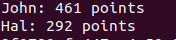
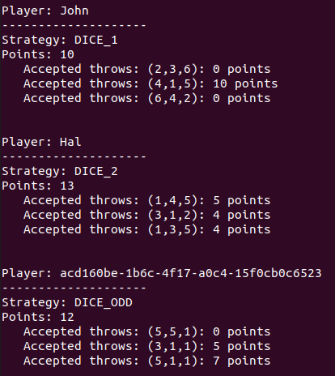

## Table of Contents
1. [General Info](#general-info)
2. [Technologies](#technologies)
3. [Prerequisites](#prerequisites)
4. [Installation](#Installation)
5. [Test](#Test)
6. [Observations](#Observations)
### General Info
***
Working code to pass the technical test "Make a game for 2 CPU players" proposed for the position of Backend Developer.
### Screenshot



## Technologies
***
* php 8.2
* composer

## Prerequisites
***
The application is encapsulated using docker virtualization and uses Make to automate test launch and installation.

It is very possible that you already have these commands in your system, if not, I leave you some links for their installation in Ubuntu:

docker & docker-compose:
* [docker && docker-compose](https://www.digitalocean.com/community/tutorials/how-to-install-and-use-docker-compose-on-ubuntu-22-04)

The installation of Make in ubuntu can be done with:
```
sudo apt-get update
sudo apt-get -y install make
```

## Installation
***
To install the application run the following command:

```
git clone git@github.com:miguelvilata/xtest.git && cd xtest && make init
```

The above command will perform:
* clone the repo at local
* start containers
* initialize de project installing vendors

After that you should be able to pass tests with:

```
make test
```

And execute the game:

```
make execute
```

### Screenshot


## Bonus

Execute for get verbose mode for a short play, with more information about the dice results and internal data. 

In verbose mode you can see a new Player with random generated name and using new created dice rule strategy.

```
make execute-verbose
```

### Screenshot


## Observations
***

Some explanations about the generated code.

The entry point for the application is index.php, you can also use index_verbose.php that show a more detailed information about internal data.

The manager class is DiceGame, that receives rounds to play and players with a game strategy to follow.
```
  $players = [
      Player::create(new UserName('John'), DiceFactory::create(DICE_STRATEGY_1)),
  ]

  DiceGame::create($players)->play(ROUNDS_TO_PLAY)
```

The implemented strategies are:
* src/Dice/Rules/Strategies:
  * Dice1Rules: 3 times roll dice within a 1 to 6 options
  * Dice2Rules: non know times roll dice if the point round is not above 5
  * Dice3Rules: new strategy for implement a rule that only allow odd values in a 3 dice rolls maximum round

